# newcomer-issue

## 3-6

LGB : Best parameters

{'boosting_type': 'goss', 'num_leaves': 63, 'max_depth': 949, 'learning_rate': 0.02061442427834546, 'n_estimators': 382, 'min_child_weight': 9.93246483600419e-08, 'min_child_samples': 10, 'reg_lambda': 9.347509937659662e-08}

---------------------------------------

RMSE : 0.436286658988412

Q^2 : 0.8710211329150095  

---------------------------------------  
※default  
Q^2 : 0.8736131293047061  
下がっている。  

## 3-7-ECFP4

SVR : Best parameters

{'kernel': 'linear', 'gamma': 'auto', 'tol': 0.04452423351599806, 'C': 0.0008675341299462108, 'epsilon': 0.07707366424031765}

---------------------------------------

RMSE : 0.5465771516029059

Q^2 : 0.7975687122642893

---------------------------------------

## 3-7-3D

SVR : Best parameters

{'kernel': 'rbf', 'gamma': 'auto', 'tol': 1.165972163302293e-07, 'C': 6.357352836096048, 'epsilon': 0.6999527204922626}

---------------------------------------

RMSE : 0.9269053938263705

Q^2 : 0.41783577938021654

---------------------------------------

かなりQ^2-valueが小さい。

## 3-8  
真値と予測値の差が0.75を超えるものを外れているデータ，0.05以内のものを当たっているデータと定義した。  
膜透過係数の対数値
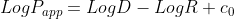

### 3-6の結果考察
|Assay ID|テストデータの数|外れているデータの数|当たっているデータの数|
|:---|:---|:---|:---| 
|CHEMBL3431937|47|6|5|
|CHEMBL905613|21|1|2|
|CHEMBL1034536|12|2|1| 
|CHEMBL3430218|6|1|0|
|Astellas|5|0|2|
|CHEMBL905612|3|0|0|  
|Enamine|1|0|0|

テストデータ数が少ないため一概には言えないが，Astellasの化合物は当たっているデータ数の割合が高い。

##### 各分子の構造  
外れているもの(真値よりも大きく予測)  
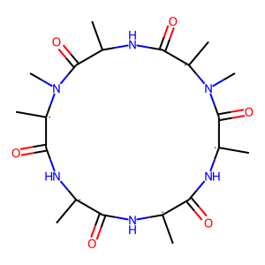

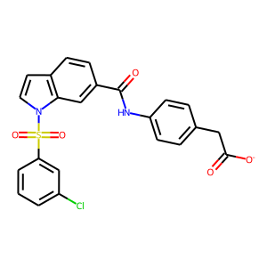
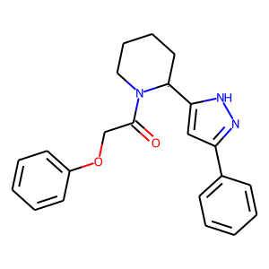
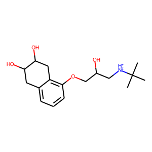
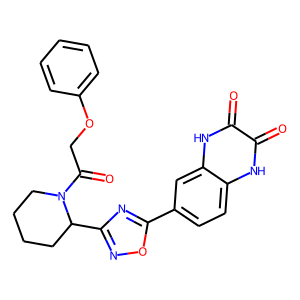
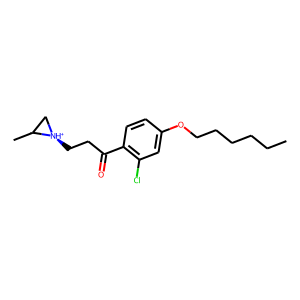  
外れているもの(真値よりも小さく予測)  
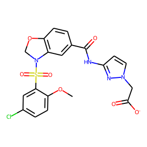
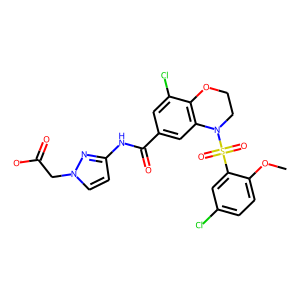
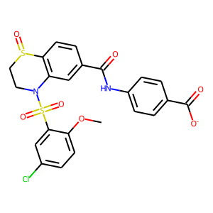

真値よりも小さく予測したものに共通する構造は以下に示す構造である。
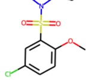

当たっているもの  
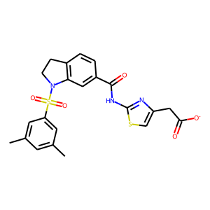
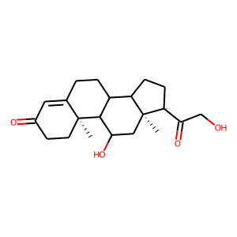
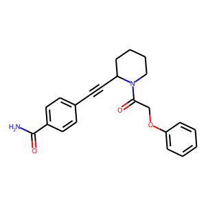
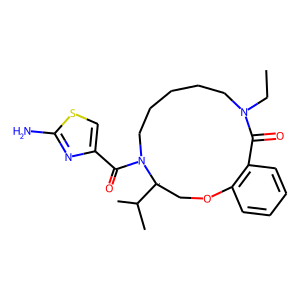
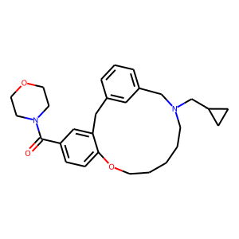
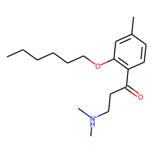
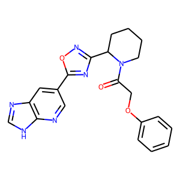
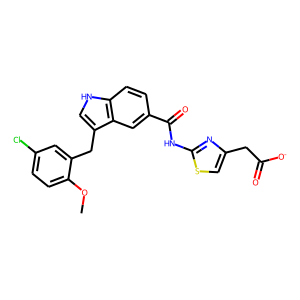
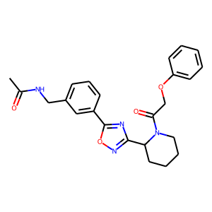

### 3-7-ECFP4の結果考察  
|Assay ID|テストデータの数|外れているデータの数|当たっているデータの数|
|:---|:---|:---|:---| 
|CHEMBL3431937|47|5|6|
|CHEMBL905613|21|7|0|
|CHEMBL1034536|12|2|1| 
|CHEMBL3430218|6|4|0|
|Astellas|5|0|1|
|CHEMBL905612|3|2|0|  
|Enamine|1|1|0|

CHEMBL905613, CHEMBL3430218, CHEMBL905612の化合物で外れている割合が高く，2D記述子同様Astellasの化合物は当たっている。

##### 各分子の構造  
外れているもの  
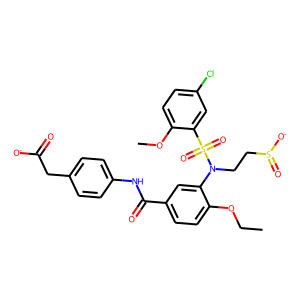
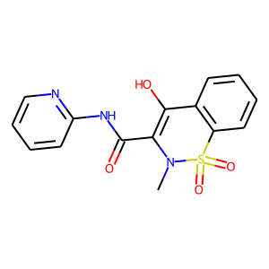
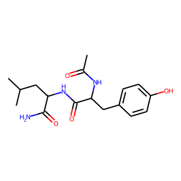
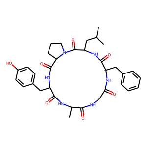

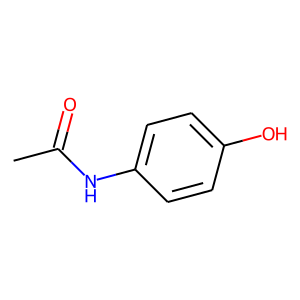

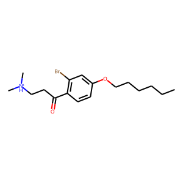
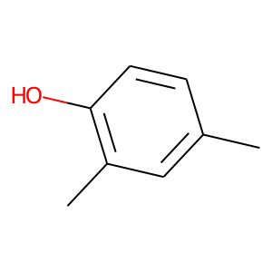
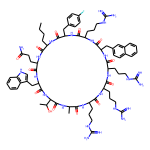

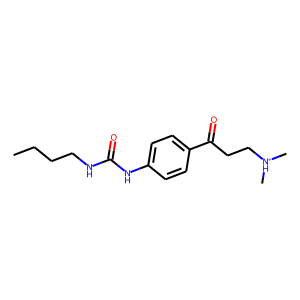

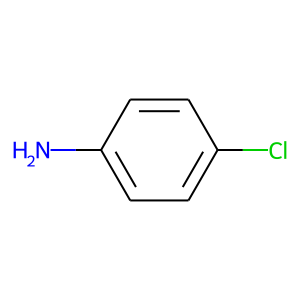

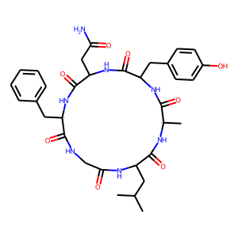
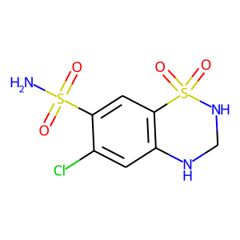

当たっているもの  
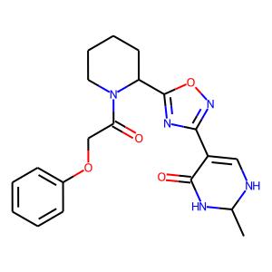
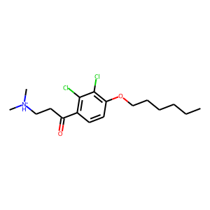

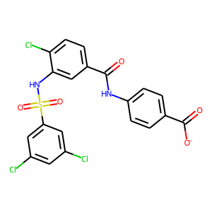
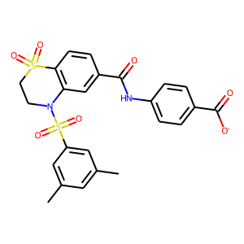

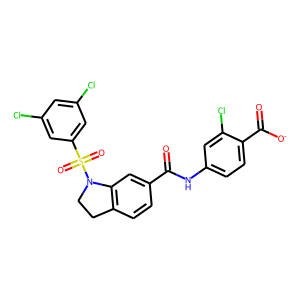

### 3-7-3dの結果考察
|Assay ID|テストデータの数|外れているデータの数|当たっているデータの数|
|:---|:---|:---|:---| 
|CHEMBL3431937|47|4|3|
|CHEMBL905613|21|6|1|
|CHEMBL1034536|12|1|1| 
|CHEMBL3430218|6|2|1|
|Astellas|5|0|1|
|CHEMBL905612|3|0|0|  
|Enamine|1|1|0|

CHEMBL905613の化合物で外れている割合が高く，2D記述子, ECFP4同様にAstellasの化合物は当たっている。

##### 各分子の構造  
外れているもの  

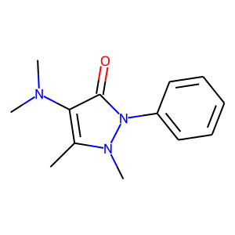

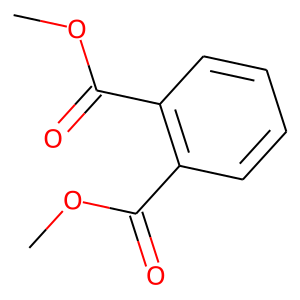

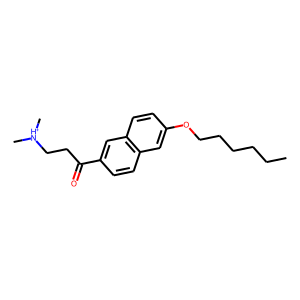

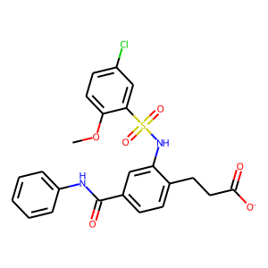

当たっているもの  
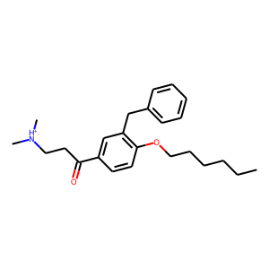

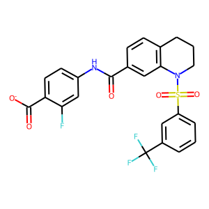
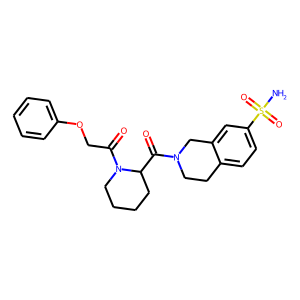

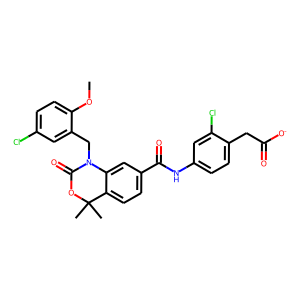
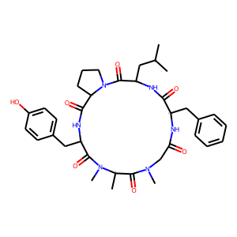

