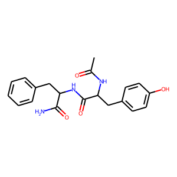
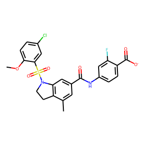

# newcomer-issue

## 3-6

LGB : Best parameters

{'boosting_type': 'goss', 'num_leaves': 63, 'max_depth': 949, 'learning_rate': 0.02061442427834546, 'n_estimators': 382, 'min_child_weight': 9.93246483600419e-08, 'min_child_samples': 10, 'reg_lambda': 9.347509937659662e-08}

---------------------------------------

RMSE : 0.436286658988412

Q^2 : 0.8710211329150095  

---------------------------------------  
※default  
Q^2 : 0.8736131293047061  
下がっている。  

## 3-7-ECFP4

SVR : Best parameters

{'kernel': 'linear', 'gamma': 'auto', 'tol': 0.04452423351599806, 'C': 0.0008675341299462108, 'epsilon': 0.07707366424031765}

---------------------------------------

RMSE : 0.5465771516029059

Q^2 : 0.7975687122642893

---------------------------------------

## 3-7-3D

SVR : Best parameters

{'kernel': 'rbf', 'gamma': 'auto', 'tol': 1.165972163302293e-07, 'C': 6.357352836096048, 'epsilon': 0.6999527204922626}

---------------------------------------

RMSE : 0.9269053938263705

Q^2 : 0.41783577938021654

---------------------------------------

かなりQ^2-valueが小さい。

## 3-8  
真値と予測値の差が0.75を超えるものを外れているデータ，0.05以内のものを当たっているデータと定義した。  
膜透過係数の対数値

より，この値は，膜を透過する際の自由エネルギーと溶質半径の対数値に依存すると考える。今回の考察においては膜透過の自由エネルギーに注目して考える。

### 3-6の結果考察
|Assay ID|テストデータの数|外れているデータの数|当たっているデータの数|
|:---|:---|:---|:---| 
|CHEMBL3431937|47|6|5|
|CHEMBL905613|21|1|2|
|CHEMBL1034536|12|2|1| 
|CHEMBL3430218|6|1|0|
|Astellas|5|0|2|
|CHEMBL905612|3|0|0|  
|Enamine|1|0|0|

テストデータ数が少ないため一概には言えないが，Astellasの化合物は当たっているデータ数の割合が高い。

##### 各分子の構造  
外れているもの(真値よりも大きく予測)  

  
真値よりも大きく予測しているということは，より，自由エネルギーを大きく見積もっていると考える。  
注目したのは，アミノ基やヒドロキシ基といった親水性の基が多いことである。このことから，疎水性の分子よりも親水性の分子の方が膜を透過する際のエネルギーが小さい，すなわち膜を透過しやすいのではないかと考えた。  

外れているもの(真値よりも小さく予測)  

  
真値よりも大きく予測しているということは，より，自由エネルギーを小さく見積もっていると考える。  
そこで注目したのが，真値よりも小さく予測したものに共通する以下の2つの構造である。  

  
膜を透過するにはイオン形よりも分子形の方が良いとされている。2つ目の構造のみであれば，真値よりも大きく予測したものの中にも含まれているが，これら2つの構造を共に有するものは小さく予測されているため，この両端の構造を持つ場合には膜透過にエネルギーがより必要となると考えた。  

当たっているもの  

  

### 3-7-ECFP4の結果考察  
|Assay ID|テストデータの数|外れているデータの数|当たっているデータの数|
|:---|:---|:---|:---| 
|CHEMBL3431937|47|5|6|
|CHEMBL905613|21|7|0|
|CHEMBL1034536|12|2|1| 
|CHEMBL3430218|6|4|0|
|Astellas|5|0|1|
|CHEMBL905612|3|2|0|  
|Enamine|1|1|0|

CHEMBL905613, CHEMBL3430218, CHEMBL905612の化合物で外れている割合が高く，2D記述子同様Astellasの化合物は当たっている。

##### 各分子の構造  
外れているもの(真値よりも大きく予測)  

  
外れているもの(真値よりも小さく予測)  

  

当たっているもの  

  

ECFP4はある距離にある部分構造をハッシュ化してバイナリ変換したものである。このことから回帰を行う際には原子間の距離という情報が利用されているのではないかと考えた。  
その際に真値よりも小さく予測しているものと大きく予測しているものを比較すると，全体として小さく予測した分子の方がシンプルな構造のように思われる。従って，ECFP4では分子内のある原子からの部分構造が小さい場合には半径が過大評価されている可能性があると考える。  
実際に当たっているものの多くは，分子数が多く，長い一本鎖構造が多いように思われる。

### 3-7-3dの結果考察
|Assay ID|テストデータの数|外れているデータの数|当たっているデータの数|
|:---|:---|:---|:---| 
|CHEMBL3431937|47|4|3|
|CHEMBL905613|21|6|1|
|CHEMBL1034536|12|1|1| 
|CHEMBL3430218|6|2|1|
|Astellas|5|0|1|
|CHEMBL905612|3|0|0|  
|Enamine|1|1|0|

CHEMBL905613の化合物で外れている割合が高く，2D記述子, ECFP4同様にAstellasの化合物は当たっている。

##### 各分子の構造  
外れているもの(真値よりも大きく予測)  

  
外れているもの(真値よりも小さく予測)  

  

当たっているもの  

  

3D記述子は分子の3次元構造を記述したものであるため，膜透過のエネルギーについて考える際に重要となる基の情報や構造情報よりも原子間の距離や離心率，慣性モーメント等の情報が多いように思われる。そのため，3D記述子全体として回帰の精度が低いのではないかと考えた。

